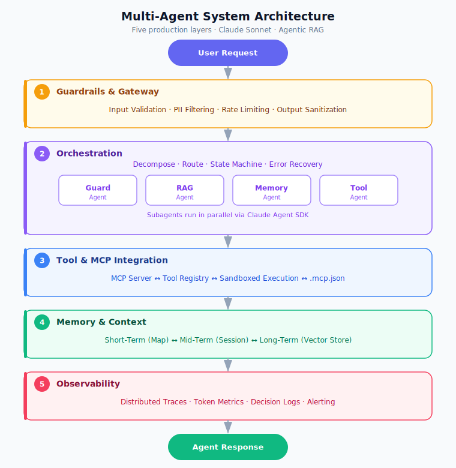
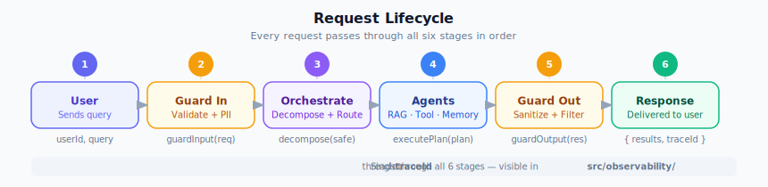
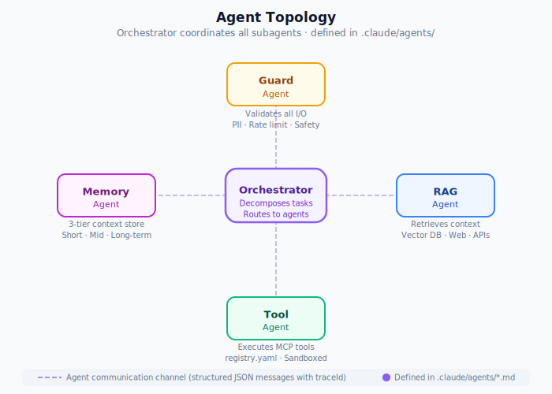
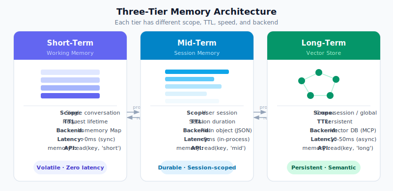

# Multi-Agent System Starter

A production-ready template for building multi-agent systems with Agentic RAG, orchestration, three-tier memory, guardrails, and observability — powered by Claude.

---



---

## Quick Start

```bash
git clone <this-repo> my-project
cd my-project
npm install
cp CLAUDE.local.md.example CLAUDE.local.md   # add your API key
npm start
```

---

## Documentation

| Guide | Description |
| ----- | ----------- |
| [Getting Started](docs/getting-started.md) | Installation, env setup, first LLM call, adding agents |
| [Architecture](docs/architecture.md) | Five-layer design, data flow, component interfaces |
| [Agents](docs/agents.md) | Agent definitions, routing protocol, adding new agents |
| [Memory System](docs/memory.md) | Three-tier memory, API reference, vector store setup |
| [Observability](docs/observability.md) | Tracing, token metrics, dashboard, external forwarding |
| [Hooks & Skills](docs/hooks-and-skills.md) | Lifecycle hooks, skill modules, allowlist config |

---

## Architecture at a glance

Five composable layers, each with a single responsibility:

| # | Layer | File | Purpose |
| - | ----- | ---- | ------- |
| 1 | Guardrails | `src/guardrails/` | Validate, filter PII, rate-limit all I/O |
| 2 | Orchestration | `src/orchestration/` | Decompose tasks, route to agents, manage state |
| 3 | Tool & MCP | `src/tools/` | Execute tools declared in `registry.yaml` |
| 4 | Memory | `src/memory/` | Short / mid / long-term context |
| 5 | Observability | `src/observability/` | Traces, token counts, decision logs |

### Request lifecycle



### Agent topology



### Memory tiers



---

## Project structure

```text
my-project/
├── CLAUDE.md                  # Project brain — auto-loaded every session
├── CLAUDE.local.md            # Personal overrides (gitignored)
├── .claude/
│   ├── settings.json          # Permissions, hooks, env vars
│   ├── agents/                # Subagent definitions (*.md with YAML frontmatter)
│   ├── skills/                # Reusable skill modules
│   └── hooks/                 # Lifecycle hooks (JS, fire deterministically)
├── src/
│   ├── index.js               # Entry point — wires all layers
│   ├── guardrails/index.js    # Layer 1
│   ├── orchestration/index.js # Layer 2
│   ├── tools/index.js         # Layer 3
│   ├── memory/index.js        # Layer 4
│   └── observability/         # Layer 5
├── agent_skills/
│   ├── tools/registry.yaml    # Tool declarations
│   ├── evals/                 # Eval suites (compositional, regression, per-skill)
│   ├── memory/                # Episodic, semantic, procedural stores
│   └── observability/         # Saved trace files
├── docs/
│   ├── images/                # SVG diagrams (architecture, memory, lifecycle, topology)
│   └── *.md                   # Documentation pages
└── .mcp.json                  # MCP server connections
```

---

## Commands

```bash
npm start             # Run the full multi-agent system
npm run orchestrate   # Run the orchestrator directly
npm run observe       # Print observability dashboard
npm run evals         # Run all eval suites
npm run evals:skill   # Run per-skill evals
npm test              # Run Jest test suite
```

---

## Claude Code integration

This project is designed for [Claude Code](https://docs.anthropic.com/claude-code).

- `CLAUDE.md` is loaded automatically at the start of every session
- Agents in `.claude/agents/` are available as subagents via the Agent SDK
- Skills in `.claude/skills/` auto-invoke when session context matches their trigger
- Hooks in `.claude/settings.json` fire deterministically on tool use and session events

---

## License

MIT
